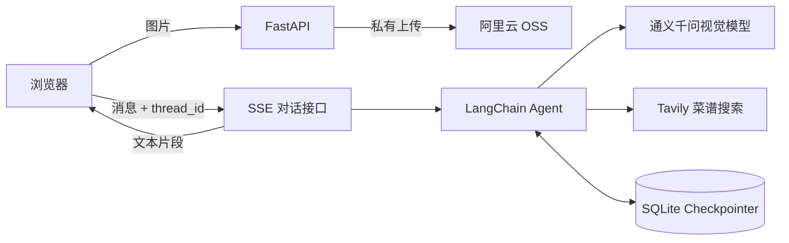

# AI 私厨（LangChain 多模态 Agent）

一个面向家庭做饭场景的多模态菜谱助手。用户可以上传食材图片并描述人数、口味、忌口或营养目标；Agent 识别食材后调用 Tavily 搜索真实菜谱，按照匹配度、营养和制作难度排序，并通过 SSE 在浏览器中流式返回结果。

## 项目亮点

- 通义千问视觉模型识别食材图片，图片通过阿里云 OSS 私有 Bucket 的临时签名 URL 传递。
- LangChain Agent 自主调用 Tavily，输出真实参考来源并减少菜谱编造。
- LangGraph SQLite Checkpointer 按 `thread_id` 保存上下文，支持连续追问和刷新恢复。
- FastAPI + SSE 实现逐段输出，并过滤工具消息与内部调用内容。
- 原生 HTML/CSS/JavaScript 前端，无框架依赖，支持 Markdown、图片预览、历史恢复和错误提示。
- API Key 全部使用环境变量，前端和健康接口不返回凭证。

## 系统架构



## 技术栈

- Python 3.11+
- FastAPI / Uvicorn
- LangChain / LangGraph
- 通义千问 OpenAI 兼容 API
- Tavily Search
- SQLite
- 阿里云 OSS
- 原生 HTML / CSS / JavaScript

## 本地运行

PowerShell 中执行：

```powershell
cd "D:\LangChain项目"
python -m venv .venv
.\.venv\Scripts\Activate.ps1
python -m pip install -r requirements.txt
Copy-Item .env.example .env
```

在 `.env` 中填写自己的密钥和 OSS 配置，然后启动：

```powershell
python -m uvicorn app.main:app --reload
```

浏览器必须打开：

```text
http://127.0.0.1:8000/
```

不要直接双击 `static/index.html`，`file://` 页面无法调用后端 API。

## API

| 方法 | 地址 | 作用 |
|---|---|---|
| GET | `/api/health` | 查看服务与必要配置状态 |
| POST | `/api/upload` | 上传 JPG、PNG 或 WebP 食材图片 |
| POST | `/api/chat/stream` | SSE 流式对话 |
| GET | `/api/history/{thread_id}` | 查询当前会话历史 |
| DELETE | `/api/history/{thread_id}` | 清空当前会话 |

`POST /api/chat/stream` 请求示例：

```json
{
  "message": "我有鸡蛋、西红柿和青椒，请推荐两道菜。",
  "image_url": null,
  "thread_id": "demo-user-001"
}
```

## 测试

```powershell
python -m pytest -q
```

建议人工验证：

1. 纯文本推荐是否调用 Tavily 并附带真实链接。
2. 图片是否成功上传至 OSS 并被模型识别。
3. 第二轮询问“详细介绍刚才第二道菜”是否利用历史。
4. 刷新页面后是否恢复历史。
5. 清空记录后历史接口是否为空。

## 安全说明

- `.env` 已被 Git 忽略，不要提交真实密钥。
- OSS 使用 RAM 子用户；生产环境应使用仅允许指定 Bucket 的最小权限策略。
- Bucket 默认私有，应用仅生成短期签名 URL。
- 上传限制为 JPG、PNG、WebP 且不超过 8 MB。

## 简历描述参考

> 独立开发基于 LangChain/LangGraph 的多模态 AI 私厨系统，集成通义千问视觉模型、Tavily 搜索和阿里云 OSS，实现食材图片识别、Agent 工具调用、菜谱多维评分、SSE 流式输出及 SQLite 会话记忆；使用 FastAPI 设计上传、对话、历史与健康检查 API，并完成凭证隔离、上传校验和工具消息过滤。

可量化为：实现 5 个核心 API、3 维菜谱评分、8 MB 图片校验、15 分钟 OSS 临时访问链接和跨页面刷新会话恢复。
