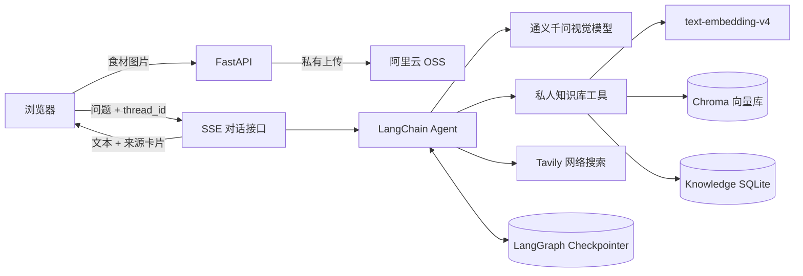

# AI 私厨：LangChain 多模态 Agentic RAG

面向家庭烹饪场景的多模态菜谱助手。用户可以上传食材图片，并将私人菜谱、营养指南、忌口说明或食品安全资料加入知识库。Agent 会根据问题自主选择本地 RAG、Tavily 网络搜索或会话历史，最后通过 SSE 流式返回带来源的菜谱建议。

## 项目亮点

- 通义千问视觉模型识别食材图片，图片通过阿里云 OSS 私有 Bucket 的临时签名 URL 传递。
- 使用 LangChain `create_agent` 实现双工具路由：私人知识库 RAG 与 Tavily 网络搜索。
- PDF、TXT、Markdown 文档经过校验、SHA-256 去重、分页提取和 `800/120` 字符切分。
- 通义 `text-embedding-v4` 生成 1024 维向量，Chroma 在本地持久化语义索引。
- 检索结果保留文档名、页码、相关度和下载地址，回答下方展示来源卡片。
- LangGraph SQLite Checkpointer 按 `thread_id` 保存上下文，支持连续追问和刷新恢复。
- FastAPI + SSE 输出文本、工具状态与结构化来源，同时过滤内部工具消息。
- 知识库支持上传、列表、下载、删除和独立检索；原始资料与向量均不提交 GitHub。
- Pytest 覆盖导入、去重、检索、删除、非法文件、扫描 PDF、API 安全与 SSE 来源去重。

## 系统架构



## 技术栈

- Python 3.11+
- FastAPI / Uvicorn / SSE
- LangChain 1.x / LangGraph
- 通义千问 OpenAI 兼容 API
- `text-embedding-v4` / Chroma
- Tavily Search
- SQLite / 阿里云 OSS
- 原生 HTML / CSS / JavaScript
- Pytest

## 本地运行

PowerShell 中执行：

```powershell
cd "D:\LangChain项目"
python -m venv .venv
.\.venv\Scripts\Activate.ps1
python -m pip install -r requirements.txt
Copy-Item .env.example .env
```

在 `.env` 中填写自己的密钥与 OSS 配置。通义 API Key 如果设置了模型访问范围，需要同时授权对话模型和 `text-embedding-v4`。

```text
QWEN_API_KEY=你的通义千问Key
QWEN_BASE_URL=https://dashscope.aliyuncs.com/compatible-mode/v1
QWEN_MODEL=qwen3-vl-235b-a22b-instruct
QWEN_EMBEDDING_MODEL=text-embedding-v4
QWEN_EMBEDDING_DIMENSIONS=1024

RAG_TOP_K=6
RAG_SCORE_THRESHOLD=0.35
MAX_KNOWLEDGE_FILE_MB=10
AUTO_INDEX_SAMPLE_KNOWLEDGE=true

TAVILY_API_KEY=你的TavilyKey

OSS_ACCESS_KEY_ID=你的RAM用户AccessKey ID
OSS_ACCESS_KEY_SECRET=你的RAM用户AccessKey Secret
OSS_ENDPOINT=https://oss-cn-beijing.aliyuncs.com
OSS_BUCKET=你的私有Bucket名称
```

启动：

```powershell
python -m uvicorn app.main:app --reload
```

浏览器必须打开：

```text
http://127.0.0.1:8000/
```

不要直接双击 `static/index.html`；`file://` 页面无法正确调用后端 API。

## 知识库使用方法

1. 点击页面右上角“知识库”。
2. 上传 PDF、TXT 或 Markdown，单文件最大 10 MB。
3. 等待“解析并向量化”完成，页面会显示生成的知识片段数量。
4. 在对话中询问“根据我的资料，减脂晚餐怎么搭配？”即可触发 RAG。
5. 询问“结合我的资料和网络菜谱推荐”时，Agent 可以同时调用 RAG 与 Tavily。

项目附带两份原创演示资料，首次启动会自动索引。扫描版或纯图片 PDF 暂不支持 OCR。

## API

| 方法 | 地址 | 作用 |
|---|---|---|
| GET | `/api/health` | 模型、Tavily、OSS、RAG 与文档数量状态 |
| POST | `/api/upload` | 上传 JPG、PNG、WebP 食材图片 |
| POST | `/api/knowledge/documents` | 上传并向量化知识文档 |
| GET | `/api/knowledge/documents` | 查询知识文档列表 |
| DELETE | `/api/knowledge/documents/{id}` | 删除原始文件、元数据和向量 |
| GET | `/api/knowledge/documents/{id}/download` | 下载原始知识文件 |
| POST | `/api/knowledge/search` | 独立测试语义检索结果 |
| POST | `/api/chat` | 非流式对话兼容接口 |
| POST | `/api/chat/stream` | SSE 流式对话与来源事件 |
| GET | `/api/history/{thread_id}` | 查询会话历史 |
| DELETE | `/api/history/{thread_id}` | 清空会话历史 |

SSE 事件类型包括：`status`、`text`、`sources`、`done` 和 `error`。`sources` 只包含前端展示需要的文档名、页码、相关度与链接，不包含工具原始 JSON。

## 测试与评测

运行自动化测试：

```powershell
python -m pytest -q
```

运行 15 条 RAG 评测用例：

```powershell
python eval/evaluate_rag.py
```

可选的真实 Agent 路由评测会产生 API 用量：

```powershell
python eval/evaluate_rag.py --live-agent
```

评测输出包括 Recall@5；实时模式还会统计工具选择准确率与来源引用覆盖率。不要在尚未运行评测前在简历中填写虚构指标。

2026-07-16 实测基线（2 份示例资料、15 条用例）：

- Recall@5：`100%`（13/13 个需要检索来源的用例命中正确文档）。
- 真实 Agent 工具选择准确率：`93.33%`（14/15）。
- 真实 Agent 来源引用覆盖率：`93.33%`（14/15）。
- 唯一漏路由用例已补充“正餐/食物类别”策略并单独回归通过；上述数字仍保留完整评测的原始结果，不将单条复测虚报为整套 100%。

## 安全说明

- `.env` 已被 Git 忽略，不要提交真实密钥。
- `data/chroma/`、`data/knowledge_files/` 和 SQLite 数据库不会上传 GitHub。
- 知识文件名会清理路径字符，文件扩展名、MIME、大小和空内容都会校验。
- OSS 使用 RAM 子用户和私有 Bucket，图片链接仅短期有效。
- 应用不会在健康接口、前端或测试日志中返回 API Key。

## 简历描述参考

> 独立开发基于 LangChain/LangGraph 的多模态 AI 私厨 Agent，集成通义千问视觉模型、Tavily 与本地 Agentic RAG；实现 PDF/TXT/Markdown 解析、SHA-256 去重、分块向量化、Chroma 语义检索、文档级来源引用和双检索工具路由，并通过 FastAPI、SSE、SQLite Checkpointer 与阿里云 OSS 完成流式对话、会话记忆和私有图片访问；建立 15 条 RAG 评测集及自动化测试，覆盖知识导入、检索、删除、安全校验和来源去重。
